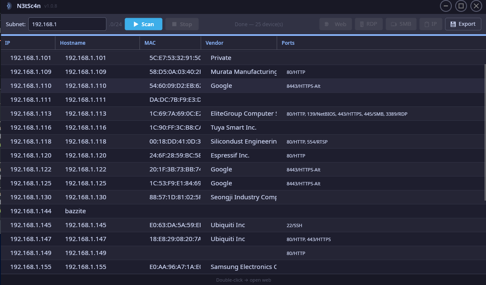

# N3tSc4n

A fast, dark-themed network scanner. Discovers all live hosts on a `/24` subnet via ICMP ping and enriches each result with hostname, MAC address, hardware vendor and open ports — results stream in as they are found.



## Features

- **Ping sweep** — scans all 254 addresses in parallel
- **Live results** — hosts appear in the table the moment they respond
- **Port detection** — HTTP, HTTPS, SSH, RDP, SMB, FTP, RTSP, and more
- **MAC & vendor lookup** — reads ARP table, resolves vendor via IEEE OUI database
- **HTML export** — save a full scan report for customer documentation
- **One-click actions** — open web interface, launch RDP, browse SMB share, or copy IP
- **Smart subnet detection** — prefers physical ethernet over Wi-Fi and virtual adapters
- **Cross-platform** — native WPF on Windows, Avalonia UI on Linux and macOS

## Download

Grab the latest release from [Releases](../../releases/latest):

| Platform | File |
|---|---|
| Windows | `NetScan.exe` |
| Linux x64 | `NetScan-x86_64.AppImage` |
| macOS Intel | `NetScan` (x64) |
| macOS Apple Silicon | `NetScan` (arm64) |

All builds are self-contained — no .NET installation required.

### Linux

```bash
chmod +x NetScan-x86_64.AppImage
./NetScan-x86_64.AppImage
```

MAC address lookup uses `ip neigh` (always available) with automatic fallback to `arp -a` if present.

### macOS

```bash
chmod +x NetScan
./NetScan
```

> RDP requires **Microsoft Remote Desktop** from the App Store.

## Usage

1. The detected subnet is pre-filled — change it if needed
2. Click **▶ Scan** to start
3. Click a row to enable the action buttons:
   - **🌐 Web** — opens the host's web interface in your browser
   - **🖥 RDP** — launches a Remote Desktop session
   - **🗂 SMB** — opens the SMB share in your file manager
   - **📋 IP** — copies the IP address to clipboard
   - **💾 Export** — saves the scan as an HTML report
4. Double-click a row to open its web interface directly
5. Click **■ Stop** to cancel a running scan

> **⚠ Subnet warning** — scanning a different subnet than your own means MAC addresses and vendor info will not be available (ARP only works within the same network segment). Ping, ports and hostname still work.

## Building from source

Requires [.NET 9 SDK](https://dotnet.microsoft.com/download).

```bash
git clone https://github.com/vildmaskine/n3tsc4n
cd n3tsc4n

# Run directly (debug build)
dotnet run --project NetScan.CrossPlatform   # Linux / macOS
dotnet run --project NetScan.Windows         # Windows

# Self-contained release builds
dotnet publish NetScan.Windows/NetScan.Windows.csproj -c Release -r win-x64 --self-contained -p:PublishSingleFile=true
dotnet publish NetScan.CrossPlatform/NetScan.CrossPlatform.csproj -c Release -r linux-x64 --self-contained -p:PublishSingleFile=true
dotnet publish NetScan.CrossPlatform/NetScan.CrossPlatform.csproj -c Release -r osx-x64 --self-contained -p:PublishSingleFile=true
dotnet publish NetScan.CrossPlatform/NetScan.CrossPlatform.csproj -c Release -r osx-arm64 --self-contained -p:PublishSingleFile=true
```

## Solution structure

```
NetScan.sln
├── NetScan.Core/           — scan engine, OUI lookup, HTML exporter, data model
├── NetScan.Windows/        — WPF frontend (Windows)
└── NetScan.CrossPlatform/  — Avalonia frontend (Linux & macOS)
```

## License

MIT
